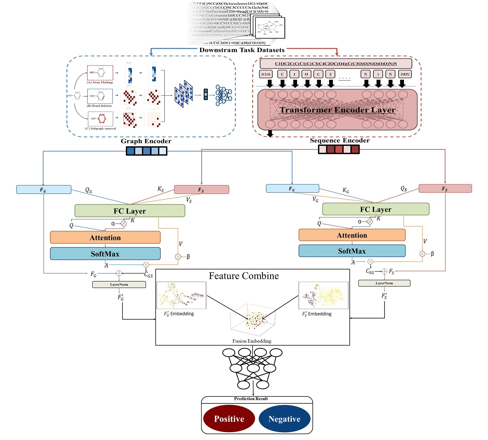
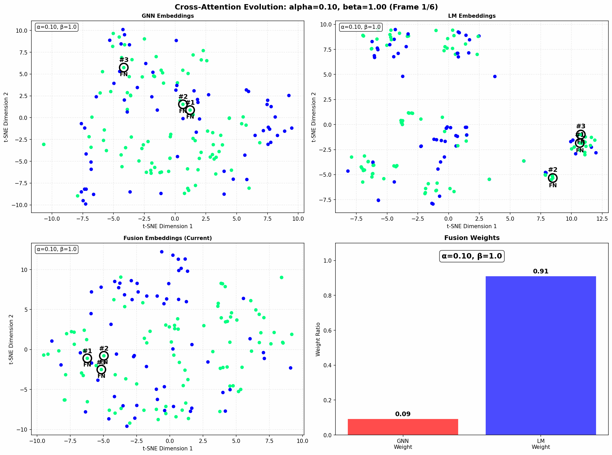
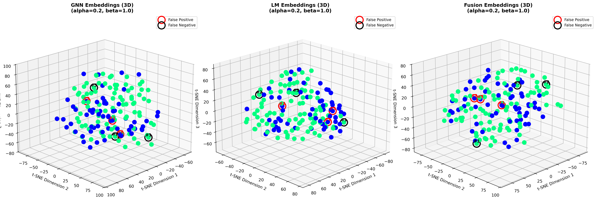
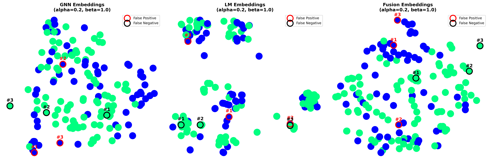

# GSCF-Net (Graph–SMILES Cross-attention Fusion Network)

GSCF-Net fuses graph-structured representations (molecular graphs) and token-level
representations from a language model (e.g. ChemBERTa) using cross-attention. The
hybrid architecture is designed for molecular property prediction tasks. This
repository contains training/evaluation scripts, dataset wrappers, and model
implementations used for experiments and reproducible evaluation.

## Result and Visualizations



## Key features

- Cross-attention fusion between a GNN encoder and a language model encoder
- Support for alpha/beta attention-ratio experiments (control direction/weighting)
- Integration with ChemBERTa (RoBERTa-family) tokenizer/model
- Differential learning rates for GNN / LM / fusion-head parameter groups
- Evaluation on common molecular property datasets (BBBP, Tox21, ClinTox, HIV, BACE, SIDER)

## Repository structure

- `GSCF-Net_finetune.py` — main training/evaluation script (ratio/attention experiments)
- `models/` — model implementations (e.g. `cross_attention_ratio.py`)
- `dataset/` — dataset wrappers and preprocessing (`hybrid_dataset.py`)
- `data/` — dataset files (expected file locations used by the scripts)
- `ChemBERTa-77M-MLM/` — local ChemBERTa tokenizer/model files (optional)
- `KIIT_Chemical_draft.pdf` — paper/draft describing the method and equations

## Requirements (short)

- Python 3.7+
- PyTorch (GPU-enabled build recommended for training)
- transformers (Hugging Face)
- scikit-learn, numpy, pandas, tqdm, tensorboard
- RDKit (optional, recommended for molecule preprocessing)

Example installation (virtual environment recommended):

```bash
python -m venv .venv
source .venv/bin/activate
pip install --upgrade pip
# Install a torch build that matches your CUDA (or CPU-only as needed)
pip install torch torchvision torchaudio
pip install transformers scikit-learn pandas numpy tqdm tensorboard
# For RDKit, we recommend conda: conda install -c conda-forge rdkit
```

## Quick start

Assuming datasets and a YAML config are prepared, a typical training run is:

```bash
# Single dataset (example: BBBP) using the attention-ratio config
python GSCF-Net_finetune.py --dataset BBBP --config config_cross_attention_ratio.yaml --repeats 3

# Run all supported datasets
python GSCF-Net_finetune.py --dataset all --config config_cross_attention_ratio.yaml --repeats 3
```

Outputs produced by the script:

- TensorBoard logs: `runs_ratio/<task_name>_<timestamp>/`
- Best model checkpoint: `runs_ratio/.../best_model.pth`
- CSV results (detailed + summaries): saved under `results/`

## Configuration

Training parameters are specified via a YAML config (e.g. `config_cross_attention_ratio.yaml`).
Key options include learning rates, batch size, epochs, the ChemBERTa model name,
and dataset splitting parameters.

Important config fields (examples):

- `cross_attention_specific.chemberta_model_name` — ChemBERTa tokenizer/model path
- `cross_attention_specific.chemberta_lr` — learning rate for the LM parameters
- `init_base_lr`, `init_lr` — learning rates for GNN and head/fusion parameters
- `dataset.valid_size`, `dataset.test_size`, `dataset.splitting`

## Supported datasets

The scripts use `DATASET_CONFIGS` defined inside the main training script. Expected
data locations (relative to the repository root):

- BBBP — `data/bbbp/BBBP.csv`
- Tox21 — `data/tox21/tox21.csv` (multi-target)
- ClinTox — `data/clintox/clintox.csv` (multi-target)
- HIV — `data/hiv/HIV.csv`
- BACE — `data/bace/bace.csv`
- SIDER — `data/sider/sider.csv` (multi-target)

Datasets are wrapped by `dataset/hybrid_dataset.py`. SMILES tokenization uses
`RobertaTokenizer` (ChemBERTa) as configured by `cross_attention_specific`.

## Model overview

GSCF-Net consists of:

- GNN encoder: embeds molecular graph structure (nodes, edges)
- LM encoder: token-level embeddings from ChemBERTa for SMILES
- Cross-attention fusion: attends between graph and token representations
- Classification head: produces final predictions (binary or multi-class)

Alpha/beta attention ratios control the relative influence between graph→text
and text→graph attention. See `KIIT_Chemical_draft.pdf` and
`models/cross_attention_ratio.py` for the mathematical details and implementation.

## Evaluation and outputs

Validation is performed using ROC-AUC (for classification tasks) at configured
intervals. When validation improves, the corresponding test performance is
evaluated and the best model checkpoint is saved. The script also aggregates
per-target and per-dataset mean ± std scores and writes CSV summaries to
`results/`.
